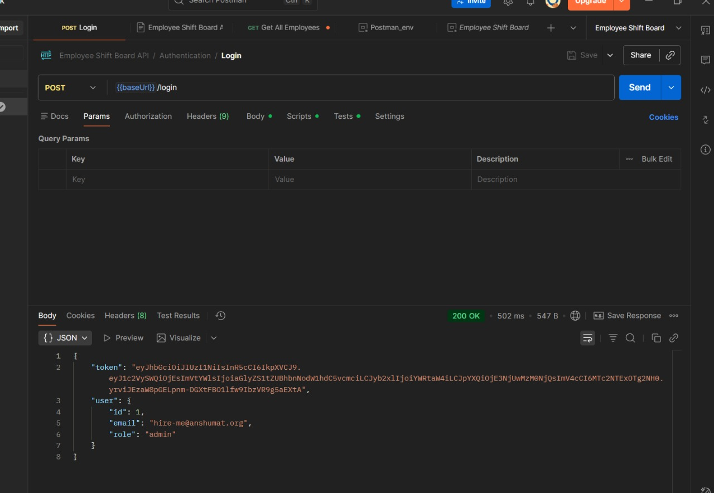
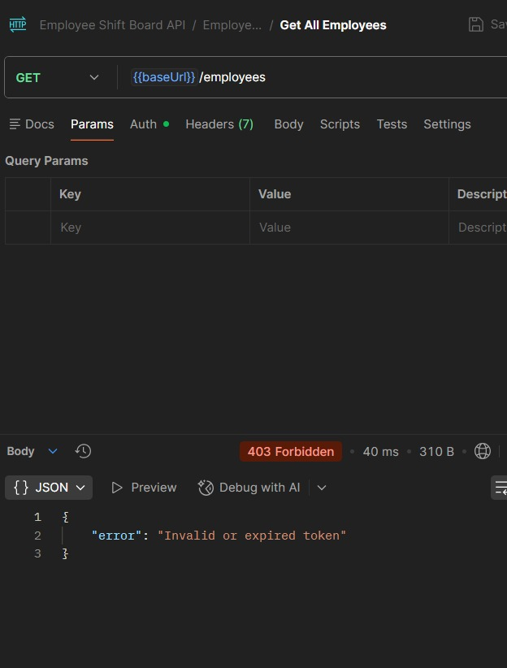
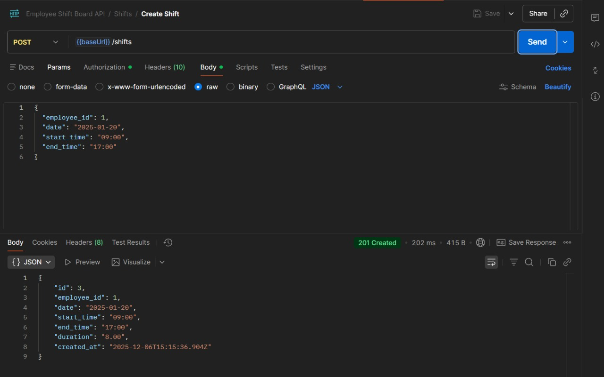
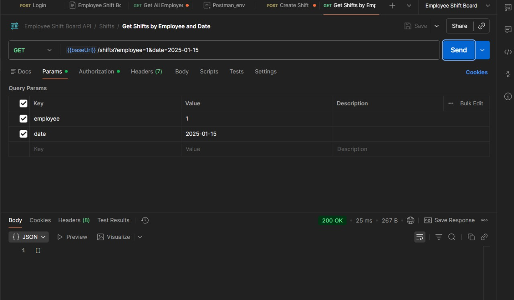
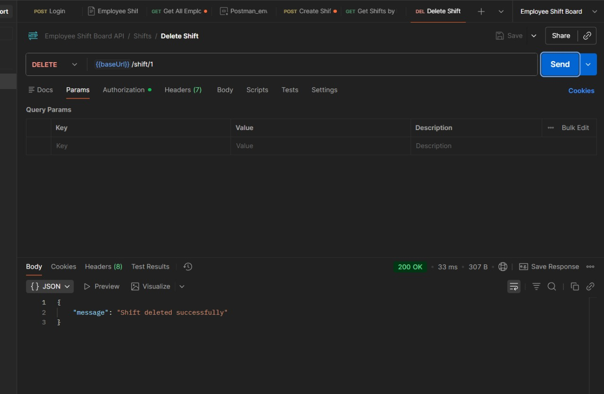
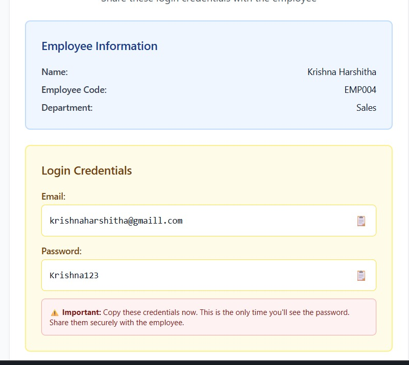
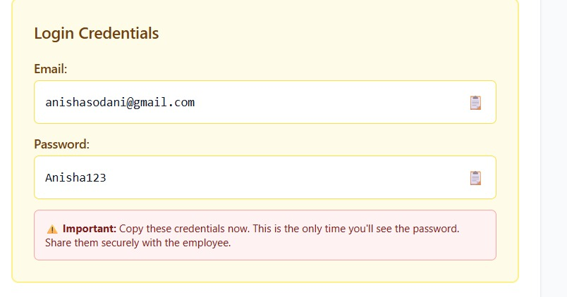

# 📸 API Testing Screenshots (Postman)

Below are the Postman tests for all required REST API endpoints.  
Each screenshot is from the actual working backend.

---

## 🔐 1. POST `/login` – User Authentication

This confirms that the login endpoint successfully returns a JWT token along with user details (`id`, `email`, `role`).  
This token is required for all further authenticated actions.



---

## 👥 2. GET `/employees` – Fetch All Employees

Retrieves a list of all employees stored in the system.  
This data is used for displaying employee records and assigning shifts.



---

## 📝 3. POST `/shifts` – Create a New Shift

Creates a new shift by providing:

- `employee_id`
- `date`
- `start_time`
- `end_time`

The API responds with the created shift details, including auto-calculated duration and a shift ID.



---

## 📅 4. GET `/shifts?employee=xx&date=xx` – Fetch Shifts

Fetches all shifts for a specific employee on a particular date.  
In this example, no shift exists for the selected date, so an empty array is returned.



---

## 🗑️ 5. DELETE `/shift/:id` – Delete a Shift

Deletes a shift using its ID.  
The server responds with:

```json
{ "message": "Shift deleted successfully" }
```



---

## 👤 Demo Login Credentials (Prototype Only)

These screenshots demonstrate how auto-generated login credentials are shown once when a new employee is created.

> ⚠️ **Note:**  
> These are demo-only credentials.  
> In real use, the credentials must be sent safely to the correct employee email.

### Demo Credentials – Example 1

Shows employee information and first-time login credentials that must be copied immediately.



### Demo Credentials – Example 2

Another example of the login credential UI.  
Credentials are shown only once for security reasons.



---
